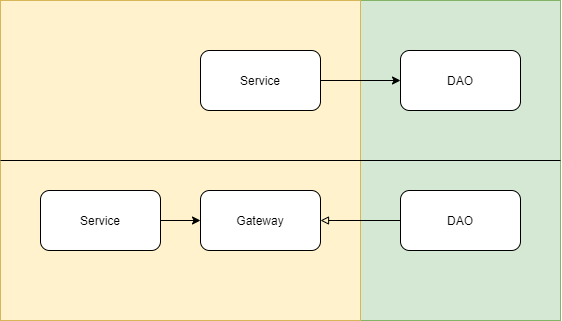
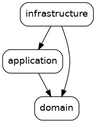
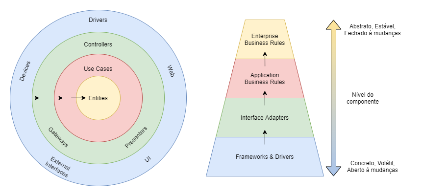
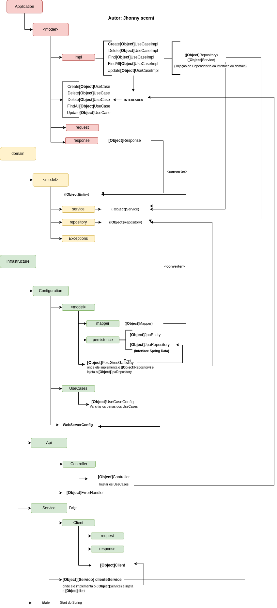

O conceito de design de software utilizado na construção da aplicação foi Clean Architecture. Com isso, é possível identificar alguns conceitos de SOLID.
### SOLID
* **Princípio da Responsabilidade Única (SRP)**, onde cada classe deve ter apenas um motivo para mudar. É possível identificar esse princípio nas classes que implementam os Casos de Uso;
* **Princípio da segregação de interfaces (ISP)**, O Princípio de Segregação de Interfaces busca orientar o desenvolvimento de forma que um código não dependa de coisas que não irá utilizar, poupando assim, uma compilação e implantação desnecessárias. 
As interfaces criadas foram refinadas para que sejam específicas do cliente. É possível ver esse princípio nas interfaces de Caso de Uso, onde cada Caso de Uso possui apenas um método público;
* **Princípio da Inversão de Dependência (DIP)**, onde módulos de alto nível não devem depender de módulos de baixo nível. Ambos devem depender da abstração. Esse princípio pode ser visto na comunicação entre as camadas do projeto, que se comunicam umas com as outras através do contrato disponibilizado pelas suas interfaces.
  Para aplicar a inversão de dependência, cria-se uma abstração para definir um contrato (uma _interface_), que deverá ser implementado por uma camada de nível mais baixo. Dessa forma, a seta de dependência inverte sua direção.
* **Princípio do aberto fechado (OCP)**, O Princípio Aberto Fechado diz que **“Um artefato de software deve ser aberto para extensão, mas fechado para modificação”**. Esse princípio é muito bem aplicado à classes e módulos, mas também tem muita importância no nível de componentes arquiteturais. “Uma boa arquitetura de software deve reduzir a quantidade de código a ser mudado para o mínimo possível. Zero seria o ideal”.
  Este princípio é o mais dependente dos outros, quase uma consequência; principalmente do Princípio da Responsabilidade Única e do Princípio da Inversão de Dependências, que, quando aplicados, separam as responsabilidades em artefatos coesos e protege artefatos de níveis mais altos dos artefatos de níveis mais baixos, respectivamente. Portanto, os artefatos de níveis mais altos são os mais fechados à mudanças e abertos a extensões.
  
---
Existem também o conceito de LSP 
* **Princípio da substituição de Liskov (LSP)**

### Projeto - Arquitetura Limpa e Framework Spring

A estrutura dos modulos do projeto está conforme a imagem abaixo:
essa imagem foi gerada com o comando : 
<b>mvn com.github.ferstl:depgraph-maven-plugin:aggregate -DcreateImage=true -DreduceEdges=false -Dscope=compile "-Dincludes=br.com.architectureprototype*:*"</b>

Nota-se que não existem setas que saem do doamin para apontar para qualquer outro componente e que as setas que saem do Application e infrastructure e apontam para o domain. Isso garante que o coração da aplicação não dependa da infraestrutura que o sustenta.

O diagrama a seguir mostra uma forma de conciliar o isolamento das regras de negócio, o core do software, e a utilização de frameworks para construir aplicações comerciais. A regra da dependência pode ser quebrada entre as camadas de frameworks (azul) e adapters (verde), pois nessas camadas não existirão códigos de negócios. 
Para as camadas de Use Case (vermelho) e Entity (amarelo), deve-se manter a regra da dependência para manter o isolamento, já que são responsáveis pelo real funcionamento da aplicação - são os códigos que queremos manter fechados para alteração, mas abertos para extensão.

Pode observar também boas práticas de desenvolvimento, é possível identificar:
* Todas as classes, métodos, atributos e variáveis foram criados com nomes que revelam a intenção;
* A maiorida dos métodos não possuem mais do que 10 linhas de código;
* A aplicação foi desenvolvida seguindo o TDD;

## STUBBY 
O stubby é para mock para exemplo de um serviço externo
stubby -d integrations.yml

Autor: Jhonny Scerni